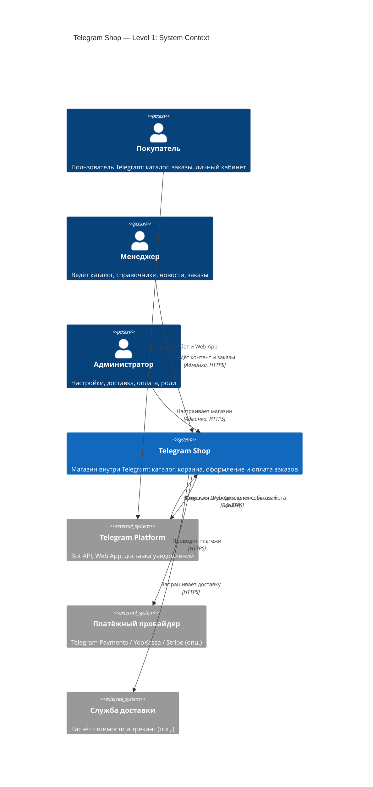
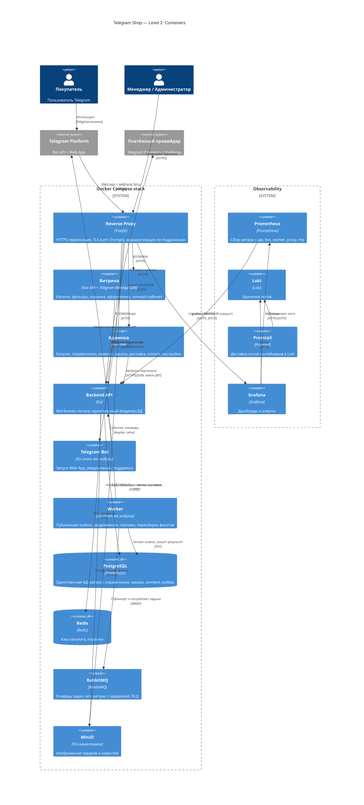
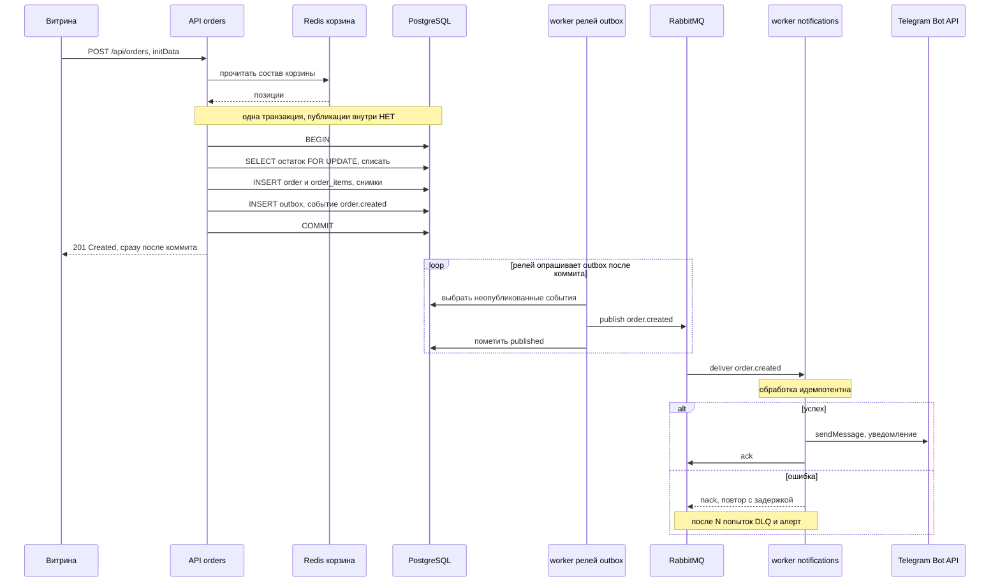
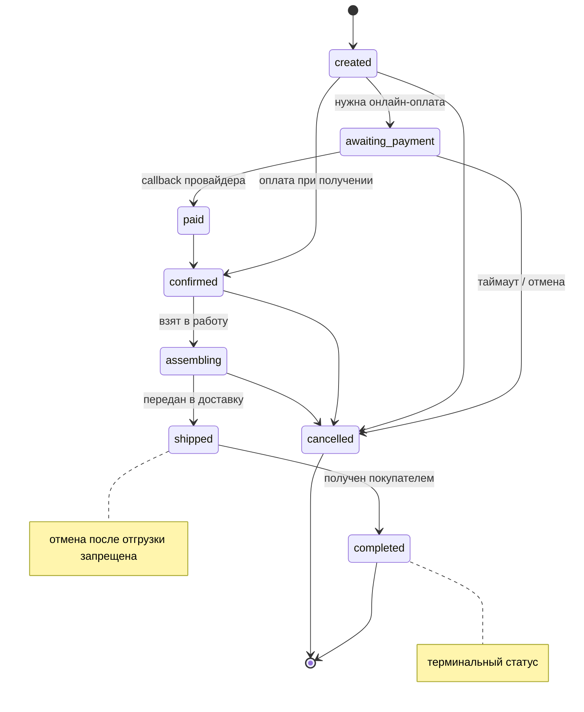

# Architecture — Telegram Shop (Open Source)

> Единая точка правды по архитектуре. Импортируется в корневой `CLAUDE.md` строкой `@./docs/architecture.md`.
>
> **Источник истины — mermaid-диаграммы.** Меняешь архитектуру → сначала правишь диаграмму нужного уровня и правило рядом, потом пишешь код. Расхождение кода или `docker-compose.yml` с диаграммой считается ошибкой.
>
> Уровни: **L1 Context** (окружение) → **L2 Container** (сервисы Docker Compose) → **L3 Component** (модули Backend API). Плюс **Dynamic view** — сценарии выполнения во времени.

---

## Stack

| Слой | Технология |
|---|---|
| Backend (API, бот, worker) | Go — один модуль, три entrypoint-а |
| Витрина + личный кабинет | Vue SPA + Telegram WebApp SDK |
| Админка | Vue SPA, отдельный поддомен |
| БД | PostgreSQL |
| Кэш, корзина | Redis |
| Очередь задач | RabbitMQ (ack, ретраи, DLQ) |
| Файловое хранилище | MinIO (S3-совместимое) |
| Reverse proxy | Traefik (HTTPS, Let's Encrypt) |
| Наблюдаемость | Prometheus (метрики), Loki + Promtail (логи), Grafana (дашборды, алерты) |

Готовая CMS (Strapi, Directus и аналоги) **сознательно не используется**: её конструктор типов недоступен в проде, а её подключение породило бы второго владельца данных. Гибкость каталога обеспечивается реестром полей и справочниками внутри Go (см. «Модель данных»).

---

## Constraints

- Open source: только свободные лицензии в ядре. Проприетарным может быть только внешний платёжный провайдер (опционально).
- Запуск одной командой `docker compose up`; один сервис = один контейнер.
- **Одна БД, один владелец.** PostgreSQL принадлежит Go API: только он мигрирует схему и пишет в неё. Никакой другой сервис не ходит в БД напрямую.
- Вся конфигурация через ENV, есть `.env.example`. Секреты в репозиторий не коммитим.
- HTTPS обязателен (требование Telegram Web App).
- Наружу открыт только reverse proxy (порты 80/443), остальные сервисы — внутри Docker-сети.

---

## Level 1 — System Context

**Правила уровня**

- Покупатель взаимодействует с системой только через Telegram-клиент.
- Менеджер и администратор — только через админку по HTTPS, на отдельном поддомене.
- `payment` и `delivery` опциональны и подключаются как внешние системы.

---

## Level 2 — Containers

**Правила уровня**

- `proxy` — единственная точка входа. **Все хосты задаются через ENV**, дефолты выводятся из `DOMAIN`:

  | Хост | Путь | Сервис |
  |---|---|---|
  | `$DOMAIN` (`SHOP_HOST`) | `/` | `web` — витрина и личный кабинет |
  | `$DOMAIN` | `/api` | `api` |
  | `$DOMAIN` | `/tg/<secret>` | `bot` — вебхук Telegram |
  | `admin.$DOMAIN` (`ADMIN_HOST`) | `/` | `adminui` |
  | `media.$DOMAIN` (`MEDIA_HOST`) | `/` | `storage` — только S3-порт 9000 |
  | `grafana.$DOMAIN` (`GRAFANA_HOST`) | `/` | `grafana`, закрыт basic-auth |

  Витрина, API и вебхук живут на одном хосте: Telegram Web App и API должны быть одного происхождения, иначе появляются CORS и проблемы с куками.
- **`storage` — единственный сервис данных, доступный снаружи**: картинки товаров грузит браузер покупателя. Наружу отдаётся только S3-порт (9000) и только на чтение; консоль администрирования (9001) остаётся внутри сети.
- **Presigned URL подписывается от публичного адреса** (`S3_PUBLIC_URL`), а не от внутреннего `storage:9000`. Подпись S3 включает заголовок Host: подписав внутренним адресом, браузер получит `SignatureDoesNotMatch`. Серверные операции (создание бакета, удаление объектов) идут по внутреннему адресу.
- `api` — **единственный владелец БД**: только он мигрирует схему и пишет данные. `bot`, `worker` и админка не имеют собственных схем; `worker` использует те же модели Go и ту же кодовую базу.
- `web` не имеет собственного логина: аутентификация покупателя — по `initData` от Telegram.
- `adminui` не ходит в БД напрямую, только через `api`, и имеет собственную аутентификацию персонала (не через Telegram).
- `bot` получает обновления по webhook; бизнес-события передаёт через `api`.
- **`api` никогда не публикует в RabbitMQ напрямую из HTTP-хендлера.** Он пишет событие в таблицу `outbox` в той же транзакции, что и доменные данные. `worker` читает `outbox` и публикует в очередь. Иначе возможен заказ без уведомления или уведомление без заказа.
- `worker` потребляет задачи из RabbitMQ: подтверждает обработку (ack), при ошибке уходит в повтор с задержкой, после исчерпания попыток — в DLQ. Задача из DLQ не теряется молча: по ней срабатывает алерт.
- Redis — **только кэш и корзины**. Очередью он не является.
- `db`, `cache`, `mq` живут в сети `data` с флагом `internal: true`: у них нет ни входа снаружи, ни выхода в интернет. `storage` подключён также к `edge`, но публикует наружу только чтение через `proxy`.
- Go-сервисы подключены к `edge` **ради исходящего трафика** (Bot API, платёжный провайдер), а не ради входящего: снаружи их открывает только `proxy` по labels. У `worker` labels нет — он недостижим извне.
- Загрузка файлов идёт напрямую в `storage` по presigned URL, выданному `api`; байты файлов через `api` не проходят.
- Локальные удобства (проброс портов PostgreSQL, Redis, RabbitMQ Management, консоли MinIO) живут в `docker-compose.override.yml` и в прод не попадают: там файлы перечисляются через `-f` явно.

---

## Level 3 — Components (Backend API)

```mermaid
C4Component
    title Telegram Shop — Level 3: Components of Backend API

    Container(web, "Витрина", "Vue SPA", "Клиент покупателя")
    Container(adminui, "Админка", "Vue SPA", "Клиент персонала")
    Container(bot, "Telegram Bot", "Go", "Точка входа, уведомления")
    ContainerDb(db, "PostgreSQL", "PostgreSQL", "Единственная БД")
    ContainerDb(cache, "Redis", "Redis", "Кэш, корзины")
    Container(mq, "RabbitMQ", "RabbitMQ", "Очередь задач")
    Container(storage, "MinIO", "S3-совместимое", "Файлы")
    System_Ext(payment, "Платёжный провайдер", "Внешние платежи")

    Container_Boundary(api, "Backend API (Go)") {
        Component(auth, "Auth Module", "Middleware", "Проверка initData, аутентификация персонала, RBAC")
        Component(content, "Content Module", "Service", "Реестр полей, справочники и их значения, новости блога")
        Component(catalog, "Catalog Module", "Service", "Товары, категории, фасетные фильтры, остатки")
        Component(cart, "Cart Module", "Service", "Корзина покупателя (Redis)")
        Component(orders, "Orders Module", "Service", "Оформление, статусы, история, снимки позиций")
        Component(deliverymod, "Delivery Module", "Service", "Способы доставки, расчёт стоимости")
        Component(paymentmod, "Payment Module", "Service", "Инициация платежей, обработка callback'ов")
        Component(outbox, "Outbox Module", "Service", "Запись доменных событий в транзакции; релей в RabbitMQ")
        Component(notifications, "Notifications Module", "Consumer", "Потребляет задачи из RabbitMQ, шлёт уведомления")
        Component(media, "Media Module", "Service", "Presigned URL, метаданные изображений")
        Component(adminmod, "Admin Module", "Service", "CRUD контента и справочников, ведение заказов, настройки")
    }

    Rel(web, auth, "initData", "HTTPS/JSON")
    Rel(adminui, auth, "Логин персонала + запросы", "HTTPS/JSON")
    Rel(bot, notifications, "События заказов", "внутр.")

    Rel(auth, catalog, "Разрешает доступ")
    Rel(auth, cart, "Разрешает доступ")
    Rel(auth, orders, "Разрешает доступ")
    Rel(auth, adminmod, "Разрешает доступ (персонал, RBAC)")

    Rel(catalog, content, "Читает реестр полей и справочники")
    Rel(catalog, db, "Читает/пишет, фасеты", "SQL")
    Rel(catalog, cache, "Кэш каталога", "TCP")
    Rel(catalog, media, "Ссылки на изображения")
    Rel(content, db, "Читает/пишет", "SQL")
    Rel(cart, cache, "Хранит корзину", "TCP")
    Rel(orders, db, "Транзакции, списание остатка", "SQL")
    Rel(orders, cart, "Забирает состав заказа")
    Rel(orders, deliverymod, "Считает доставку")
    Rel(orders, paymentmod, "Инициирует оплату")
    Rel(orders, outbox, "Пишет событие в той же транзакции")
    Rel(deliverymod, db, "Способы доставки", "SQL")
    Rel(paymentmod, payment, "Платёж, статус, callback", "HTTPS")
    Rel(paymentmod, db, "Платежи", "SQL")
    Rel(paymentmod, outbox, "Событие об оплате")
    Rel(outbox, db, "Читает/пишет outbox", "SQL")
    Rel(outbox, mq, "Публикует события", "AMQP")
    Rel(notifications, mq, "Потребляет задачи, ack/DLQ", "AMQP")
    Rel(media, storage, "Presigned URL", "S3 API")
    Rel(adminmod, content, "Ведёт справочники, поля, новости")
    Rel(adminmod, catalog, "CRUD товаров и категорий")
    Rel(adminmod, orders, "Смена статусов заказов")
    Rel(adminmod, db, "Настройки, роли", "SQL")
```

**Правила уровня**

- `auth` — единая точка авторизации: валидирует `initData` покупателя и логин персонала, применяет RBAC (администратор / менеджер заказов / контент-менеджер).
- `content` владеет гибкостью каталога: реестр полей, справочники, значения справочников, новости. Никакой другой модуль не меняет схему полей.
- `catalog` — единственный, кто пишет товары и категории; он же поддерживает таблицу фасетов при каждой записи.
- Корзина живёт в Redis (`cart` → `cache`), не в PostgreSQL.
- `orders` оркестрирует оформление в **одной транзакции**: собирает состав из `cart`, списывает остаток с блокировкой строки, считает доставку, пишет заказ и событие в `outbox`. Публикация в брокер происходит уже после коммита, релеем.
- `outbox` — единственная точка публикации в RabbitMQ. Доменные модули не знают о брокере, они пишут события в таблицу.
- `notifications` — потребитель, а не отправитель: обрабатывает задачу, подтверждает ack, при ошибке уходит в повтор, после исчерпания попыток — в DLQ. Обработка идемпотентна (повторная доставка не должна слать второе сообщение покупателю).
- К внешнему платёжному провайдеру обращается только `paymentmod`; к файловому хранилищу — только `media`.
- Админка не имеет привилегированного доступа к БД: `adminmod` вызывает те же доменные сервисы, что и витрина, поэтому инварианты (переходы статусов, остатки, валидация полей) соблюдаются одинаково.

---

## Динамика — сценарии выполнения (Dynamic view)

> Уровни L1–L3 показывают структуру; этот раздел — поведение во времени. Диаграммы **производны** от правил L2 (outbox) и L3 (orders): при расхождении сначала правится правило, затем диаграмма.

### Оформление заказа и доставка уведомления (transactional outbox)

Ключевой инвариант ADR-004: `api` **не публикует в брокер из HTTP-хендлера**. Событие пишется в `outbox` в той же транзакции, что и заказ; публикует его релей в `worker` уже после коммита. Поэтому невозможны ни заказ без уведомления, ни уведомление по откаченному заказу. Потребитель идемпотентен: повторная доставка не шлёт второе сообщение.

### Жизненный цикл заказа

Набор статусов **индикативен** — он фиксируется в коде `orders` (в диаграмме и модели данных статусы пока не перечислены явно). Диаграмма закрепляет инвариант: **переход возможен только по стрелке**, и это правило одинаково для витрины и админки (`adminmod` вызывает тот же доменный сервис). `completed` и `cancelled` — терминальные; отмена после отгрузки запрещена.

---

## Модель данных

> Визуализация схемы — [`database.md`](./database.md) (Mermaid erDiagram, рендерится на GitHub). Это **производная** от данного раздела: источник правды — текст ниже и миграции Go. При расхождении сначала правится этот раздел, затем `database.md`.

Основные сущности: `categories`, `products`, `product_images`, `media`, `posts` (новости), `delivery_methods`, `payment_methods`, `orders`, `order_items`, `payments`, `users`, `admin_users`, `roles`, `admin_refresh_tokens`, `outbox`.

Гибкая часть каталога:

- `dictionaries` — справочники (Материал, Тип товара, Форма…). Заводятся менеджером в рантайме, без деплоя.
- `dictionary_values` — значения справочников. Расширяются менеджером постоянно.
- `field_definitions` — реестр полей: какие характеристики есть у категории, их тип, обязательность, валидация, порядок, показывать ли колонкой в списке. Типы полей включают «значение из справочника» и «несколько значений из справочника».
- `products.attributes JSONB` — значения характеристик товара.
- `product_facets` — служебная таблица связей «товар ↔ значение справочника», пересобирается `catalog` при каждой записи товара. По ней работают фильтры витрины.

**Правила модели**

- **В `attributes` хранится id значения справочника, а не текст.** Переименование значения подхватывается везде разом.
- **Значение справочника не удаляется, если используется, — архивируется.** Архивное не предлагается в новых товарах, но корректно отображается в старых.
- **Поле не удаляется, а помечается устаревшим.** Смена типа существующего поля запрещена: создаётся новое поле и переносятся данные.
- **Поле, по которому фильтруют или сортируют, — это колонка или запись в `product_facets`, а не поиск по JSONB.** JSONB — для того, что просто отображается.
- **`order_items` хранит снимок позиции** (название, цена, характеристики на момент покупки). То же для способа доставки и оплаты в заказе. Изменение каталога никогда не переписывает историю заказов.
- Валидация `attributes` при записи выполняется в Go по `field_definitions`. «В JSONB что угодно» недопустимо.
- **`outbox` пишется только в транзакции доменной операции.** Строка содержит тип события, payload и статус публикации. Релей помечает опубликованное; неопубликованное копится и не теряется при недоступности брокера.
- **`admin_refresh_tokens` — серверная сессия персонала, чтобы `logout` реально отзывал доступ.** Хранит хэш refresh-токена (никогда не сам токен), FK на `admin_users`, срок действия и `revoked_at` (отзыв, а не удаление строки — тот же архивный инстинкт, что и у справочников). Это часть механизма аутентификации админки (`auth`, RBAC), отдельного от аутентификации витрины: `initData` покупателя проверяется на сервере при каждом запросе и принципиально не создаёт серверной сессии — там нечего отзывать и нечего хранить. Таблица живёт в PostgreSQL, а не в Redis: Redis в проекте — только кэш каталога и корзины (см. Constraints), а не хранилище сессий/токенов.

---

## Security rules

- Наружу открыт только `proxy` (80/443); остальные сервисы — внутри Docker-сети. Grafana закрыта basic-auth или VPN.
- Проверка `initData` выполняется только на сервере (`api`), никогда на клиенте.
- Секреты (токен бота, пароли БД, ключи MinIO и платёжного провайдера) — только через ENV/secrets, никогда в БД и никогда в репозитории.
- Витрина и админка используют разные механизмы аутентификации.
- Платёжные callback'и валидируются подписью провайдера и обрабатываются идемпотентно.
- Загрузка файлов — только по presigned URL с ограничением типа и размера.

---

## Observability

- `api` (:8080), `bot` (:8081) и `worker` (:8082) отдают `/metrics` для Prometheus. Traefik отдаёт метрики на отдельном entrypoint `:8082`, RabbitMQ — плагином `rabbitmq_prometheus` на `:15692`.
- Метрики PostgreSQL и Redis требуют отдельных экспортеров и **пока не собираются**. Добавляются при появлении реальной нагрузки.
- Логи — структурированные (JSON) в stdout, забираются Promtail через Docker service discovery и уезжают в Loki.
- Обязательный минимум дашбордов: RPS и задержки API, ошибки 5xx, глубина очередей RabbitMQ, размер DLQ, возраст самой старой неопубликованной записи в `outbox`, доля успешных платежей, состояние вебхука Telegram.
- Алерты обязательны на: непустую DLQ и растущий возраст неопубликованного `outbox` — это два места, где данные молча расходятся с реальностью.
- Алерты настраиваются во встроенном алертинге Grafana; отдельный Alertmanager не используется.

---

## Как использовать в Claude Code

1. Файл лежит в `docs/architecture.md` и импортируется в корневой `CLAUDE.md` строкой `@./docs/architecture.md`.
2. Меняешь архитектуру → сначала правишь диаграмму нужного уровня и правило рядом, потом пишешь код.
3. Расхождение кода или `docker-compose.yml` с диаграммой — ошибка. Правится документ, затем код.
