# Database — ERD (Entity-Relationship Diagram)

> **Источник правды — [`architecture.md`](./architecture.md), раздел «Модель данных», и миграции Go** (владелец схемы — `api`). Эта диаграмма **визуализирует** модель, а не задаёт её: при расхождении сначала правится раздел «Модель данных», затем диаграмма ниже.
>
> Типы колонок и `bigint`-ключи **индикативны** — точный тип PK ещё не зафиксирован в миграциях. Отражены инварианты из `architecture.md` и ADR-002/004:
> - `attributes` хранит id значений справочников, а не текст;
> - значение справочника архивируется (`archived_at`), а не удаляется;
> - поле не удаляется, а помечается устаревшим (`is_deprecated`);
> - `order_items` / `orders` хранят снимок позиции, доставки и оплаты;
> - `outbox` пишется в транзакции доменной операции, публикуется релеем;
> - `admin_refresh_tokens` хранит хэш refresh-токена персонала (не сам токен) и отзывается (`revoked_at`), а не удаляется — серверная сессия админки, которой нет у стейтлес-`initData` витрины.

```mermaid
erDiagram

    %% --- Каталог: гибкая часть (ADR-002) --------------------------------
    categories {
        bigint      id PK
        bigint      parent_id FK "родитель, nullable (дерево категорий)"
        text        name
        text        slug UK
        int         position
        boolean     is_active
        timestamptz created_at
        timestamptz updated_at
    }

    dictionaries {
        bigint      id PK
        text        name
        text        code UK
        timestamptz created_at
    }

    dictionary_values {
        bigint      id PK
        bigint      dictionary_id FK
        text        value
        int         position
        timestamptz archived_at "NULL = активно; использованное не удаляется, а архивируется"
        timestamptz created_at
    }

    field_definitions {
        bigint      id PK
        bigint      category_id FK
        bigint      dictionary_id FK "для типов dictionary / dictionary_multi, иначе NULL"
        text        code
        text        label
        text        type "string, number, bool, dictionary, dictionary_multi, ..."
        boolean     required
        jsonb       validation
        int         position
        boolean     show_in_list "показывать колонкой в списке"
        boolean     is_deprecated "поле не удаляется, а помечается устаревшим; смена типа запрещена"
        timestamptz created_at
    }

    products {
        bigint      id PK
        bigint      category_id FK
        text        name
        text        slug UK
        numeric     price
        int         stock "остаток"
        jsonb       attributes "id значений справочников (не текст); валидируется Go по field_definitions"
        boolean     is_active
        timestamptz created_at
        timestamptz updated_at
    }

    product_images {
        bigint      id PK
        bigint      product_id FK
        bigint      media_id FK
        int         position
        text        alt
    }

    %% Служебная таблица фасетов: пересобирается catalog при каждой записи товара.
    %% По ней работают фильтры витрины — обычным индексом, а не поиском по JSONB.
    product_facets {
        bigint      id PK
        bigint      product_id FK
        bigint      field_definition_id FK
        bigint      dictionary_value_id FK
    }

    media {
        bigint      id PK
        text        bucket
        text        object_key UK
        text        content_type
        bigint      size
        int         width
        int         height
        timestamptz created_at
    }

    %% --- Контент --------------------------------------------------------
    posts {
        bigint      id PK
        text        title
        text        slug UK
        text        body
        bigint      cover_media_id FK "nullable"
        timestamptz published_at "NULL = черновик"
        timestamptz created_at
        timestamptz updated_at
    }

    %% --- Заказы, доставка, оплата ---------------------------------------
    delivery_methods {
        bigint      id PK
        text        name
        text        code UK
        numeric     price
        jsonb       config
        boolean     is_active
    }

    payment_methods {
        bigint      id PK
        text        name
        text        code UK
        text        provider
        boolean     is_active
    }

    orders {
        bigint      id PK
        bigint      user_id FK
        bigint      delivery_method_id FK "ссылка на текущий метод, nullable"
        bigint      payment_method_id FK "ссылка на текущий метод, nullable"
        text        status
        numeric     total
        text        delivery_name_snapshot "снимок способа доставки на момент заказа"
        numeric     delivery_price_snapshot "снимок"
        text        payment_name_snapshot "снимок способа оплаты на момент заказа"
        jsonb       delivery_address
        timestamptz created_at
        timestamptz updated_at
    }

    order_items {
        bigint      id PK
        bigint      order_id FK
        bigint      product_id FK "снимок-ссылка, nullable: изменение каталога не переписывает историю"
        text        name_snapshot "название на момент покупки"
        numeric     price_snapshot "цена на момент покупки"
        int         qty
        jsonb       attributes_snapshot "характеристики на момент покупки"
    }

    payments {
        bigint      id PK
        bigint      order_id FK
        text        provider
        text        provider_payment_id UK "идемпотентность callback провайдера"
        text        status
        numeric     amount
        timestamptz created_at
        timestamptz updated_at
    }

    %% --- Пользователи и RBAC --------------------------------------------
    users {
        bigint      id PK
        bigint      telegram_id UK
        text        username
        text        first_name
        text        last_name
        timestamptz created_at
    }

    admin_users {
        bigint      id PK
        text        email UK
        text        password_hash
        bigint      role_id FK
        boolean     is_active
        text        full_name "опционально, для отображения в админке"
        timestamptz created_at
    }

    roles {
        bigint      id PK
        text        name
        text        code UK "admin, order_manager, content_manager"
        jsonb       permissions
    }

    %% Серверная сессия персонала: логаут отзывает (revoked_at), а не удаляет
    %% строку — та же логика, что архивация справочных значений. Отдельно от
    %% витрины: initData покупателя стейтлес и не хранит серверной сессии.
    admin_refresh_tokens {
        bigint      id PK
        bigint      admin_user_id FK
        text        token_hash UK "хэш refresh-токена, не сам токен"
        timestamptz expires_at
        timestamptz revoked_at "NULL = активна; отзыв при logout/ротации"
        timestamptz created_at
    }

    %% --- Transactional outbox (ADR-004) ---------------------------------
    outbox {
        bigint      id PK
        text        event_type
        jsonb       payload
        text        status "pending, published"
        timestamptz created_at
        timestamptz published_at "NULL = не опубликовано; растущий возраст = алерт"
    }

    %% --- Связи ----------------------------------------------------------
    categories        ||--o{ categories         : "родитель"
    categories        ||--o{ field_definitions  : "поля категории"
    categories        ||--o{ products           : "содержит"
    dictionaries      ||--o{ dictionary_values  : "значения"
    dictionaries      |o--o{ field_definitions  : "тип-справочник"
    products          ||--o{ product_images     : "изображения"
    media             ||--o{ product_images     : "файл"
    products          ||--o{ product_facets     : "фасеты товара"
    field_definitions ||--o{ product_facets     : "поле"
    dictionary_values ||--o{ product_facets     : "значение"
    media             |o--o{ posts              : "обложка"
    users             ||--o{ orders             : "заказы"
    orders            ||--o{ order_items        : "позиции"
    products          |o--o{ order_items        : "снимок позиции"
    orders            ||--o{ payments           : "платежи"
    delivery_methods  |o--o{ orders             : "способ доставки"
    payment_methods   |o--o{ orders             : "способ оплаты"
    roles             ||--o{ admin_users        : "роль"
    admin_users       ||--o{ admin_refresh_tokens : "сессии"
```

